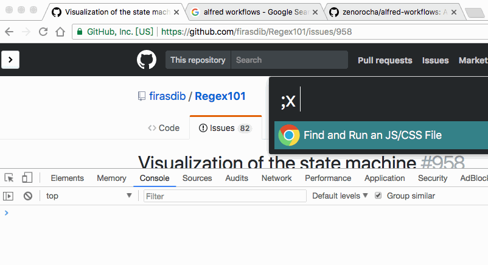
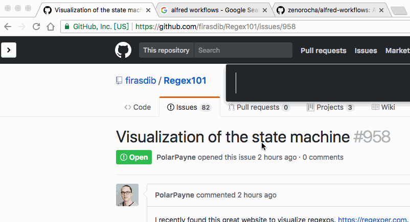
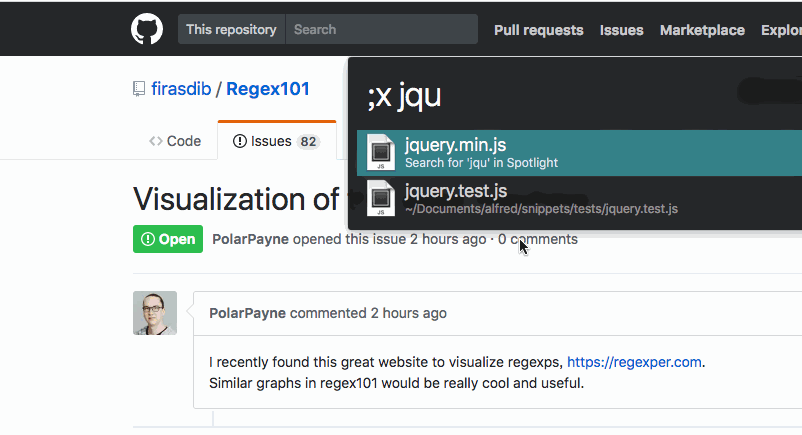

chrome-scripts [下载](Chrome%20Scripts.alfredworkflow?raw=true)
==============

This alfred3 workflow allows:

1. Inject local js/css files into chrome active tab
2. Search/Switch between all tabs


### Inject local js/css files into chrome active tab

Use the `;x` keyword.

```bash
mkdir -p ~/Documents/alfred/snippets && cd -
echo "console.log('hello world')" > hello.js
```



#### Note: 

- files are located in `~/Documents/alfred/snippets` by default, you can change that in workflow preferences.
- return value of js will be copied into clipboard, so that you can crawl data from web pages
### Search/Switch between all tabs

Use the `;t` keyword.




### Bonus

You can inject multiple files into a page using [alfred file buffer](https://www.alfredapp.com/help/features/file-search/#file-buffer).
 
 Say, your **github-purplish.js** requires jquery:

```js
 $("body").css("color", "");
```

You can do :



